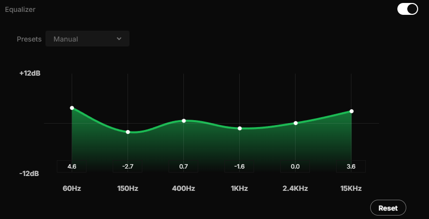

# BetterEqualizer Spicetify Extension

## Description

BetterEqualizer is an extension that enhances the lackluster built-in equalizer that spotify provides. This extension adds input boxes for each band in the equalizer that allow you to input precise decibel values. This allows you to input precise values using the spotify equalizer setting from [AutoEq](https://autoeq.app/)

## Manual Installation

This extension requires [Spicetify](https://spicetify.app/docs/getting-started) to be installed and set up.

1. **Download the Script:**
   Save the `betterEqualizer.js` script into your Spicetify extensions directory.

   * **Windows:** `%appdata%\spicetify\Extensions\`

   * **macOS/Linux:** `~/.config/spicetify/Extensions/`

3. **Apply with Spicetify:**
   Open your terminal or command prompt and run the following commands:
   ```
   spicetify config extensions betterEqualizer.js
   spicetify apply
   ```
## Usage

1. Open Spotify.

2. Go to `Settings` (Profile icon -> Settings).

3. Navigate to `Audio Quality` -> `Equalizer`.

4. You will now see a numerical input box directly below each equalizer slider.

5. You can either:
    * Drag the sliders as usual. The input boxes will update automatically.
    * Type a precise value into an input box and press `Enter` or click outside the box. The corresponding slider will move to that exact value.

## Contributing

Feel free to open issues for bug reports or suggest improvements. Pull requests are welcome!

## License

This project is open-source and available under the [MIT License](https://github.com/kryptoxdev/BetterEqualizer/blob/main/LICENSE).

## Credits

Built with [Spicetify](https://spicetify.app/).
